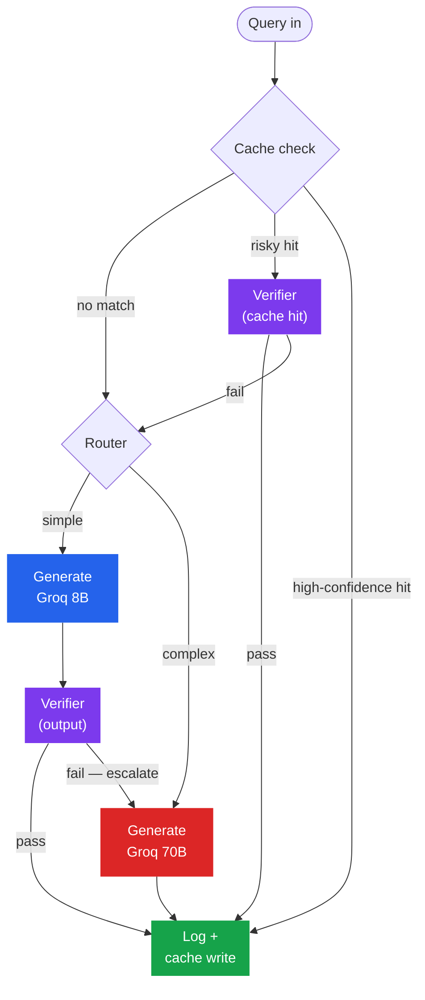

<div align="center">

# Verified Cost Router

**A LangGraph pipeline that adds a verification gate to semantic caching and complexity routing — so a risky decision is checked before it's served, not trusted blindly.**

[](https://github.com/Arshanapally-Akshith/verified-cost-router/releases/tag/v1.0.0)
[](pyproject.toml)
[](#testing)
[](https://github.com/langchain-ai/langgraph)
[](https://groq.com)
[](dashboard/app.py)

[Results](#results-at-a-glance) · [Why this exists](#why-this-exists) · [Pipeline](#pipeline) · [Setup](#setup) · [Usage](#usage) · [Evaluation](#evaluation-results)

</div>

---

Semantic caching (GPTCache) and complexity routing (RouteLLM) both cut LLM
API costs — and both **trust their own decision without checking it**.
This project measures that gap empirically, then closes it: a Verifier
agent sanity-checks every risky cache hit and every cheap-model output
before it reaches the user, and this README reports the precision/recall
of that gate catching bad decisions — not just the claim that it does.

## Results at a glance

Measured against a 100-pair labeled adversarial set, 50 labeled
complexity items, and 30 replayed real-world queries ([full report](data/eval_report.md)):

| | Metric | Result |
|---|---|---|
| 🎯 | Cache precision / recall | **50.0% / 100.0%** |
| 🧭 | Router complex-recall (adversarial) | **98.0%** (49/50) |
| 🛡️ | Verifier catch rate — bad cache hit | **100.0%** near-miss |
| 🛡️ | Verifier catch rate — bad route | 0.0% *(n=1, too small to generalize — reported as-is)* |
| ✅ | Quality-regression spot check | **100%** comparable to strong model |
| 💰 | Full-system cost vs. no-system baseline | **-0.6%**, verifier adds no measurable cost tax |

The headline finding isn't a clean win — it's an honest one: cache
precision tops out at **~60%** because true-duplicate and near-miss
queries genuinely overlap in embedding space (see [Evaluation results](#evaluation-results)).
That's the GPTCache failure mode this project set out to measure, and
it's exactly why the Verifier exists instead of a single similarity
threshold.

## Why this exists

| Tool | What it does | What it doesn't do |
|---|---|---|
| **GPTCache** | Semantic cache: embed, vector search, threshold-based serve | No routing at all. No verification of cache-hit correctness — trusts the similarity score. |
| **RouteLLM** | Trained classifier routes to weak/strong model based on complexity | No caching. No verification of routing correctness — trusts the classifier. |
| **Portkey / gateways** | Config-driven caching + routing + observability behind one gateway | Tunable knobs, not a workload-specific evaluation methodology. No verification gate. |
| **Verified Cost Router** | Cache + router, same as above | Adds an explicit verification gate on risky cache hits and cheap-model outputs, **and reports precision/recall of that gate catching bad decisions.** |

GPTCache's own documentation acknowledges embedding similarity can match
texts with opposite meaning but similar wording. RouteLLM's classifier
can misroute a query that's worded simply but requires strong-model
reasoning. Gateways expose both as tunable thresholds with no published,
workload-specific evaluation methodology. This project treats both
decisions as probabilistic, adds a cheap verification stage to catch
their failure modes, and measures how often it actually works.

## Pipeline



| Component | Path | What it does |
|---|---|---|
| **Cache layer** | `cache/` | Local sentence-transformer embeddings + FAISS. Two similarity cutoffs (`no_match` / `risky_hit` / `high_confidence_hit`), chosen by sweeping the labeled eval set, not picked by eye — `scripts/tune_cache_thresholds.py`. |
| **Router** | `router/` | Prompt-based complexity classifier (Groq 8B) labeling each query `simple` / `complex` — not a trained model, and not just a length heuristic. |
| **Verifier** | `verifier/` | A Groq-8B agent used in two places: sanity-checking a risky cache hit against the new query, and sanity-checking a cheap-model output before it's served. A fail escalates to the router or the strong model respectively. |
| **Generation** | `llm/` | Thin `requests` wrapper around Groq's OpenAI-compatible endpoint. Retry-with-backoff on 429s (capped, so a near-exhausted quota fails fast instead of blocking silently) plus a watchdog thread that guarantees every call returns or raises within a bounded time. |
| **Orchestration** | `graph.py`, `pipeline/` | The topology above wired as a LangGraph state machine. `build_graph()` wires stub nodes (topology-only proof); `build_pipeline_graph()` wires the real components via `pipeline.nodes.PipelineNodes`. |

## Setup

Requires Python ≥3.11 and a free [Groq](https://console.groq.com) API key (no card required).

```bash
python -m venv .venv
source .venv/Scripts/activate   # .venv/bin/activate on macOS/Linux
pip install -e ".[dev]"

cp .env.example .env            # then fill in GROQ_API_KEY
```

`GROQ_CHEAP_MODEL` / `GROQ_STRONG_MODEL` in `.env` are optional overrides
of the defaults (`llama-3.1-8b-instant` / `llama-3.3-70b-versatile`), in
case Groq renames or retires a model.

## Usage

```bash
# Run one query through the real pipeline
python -m verified_cost_router.main "What is the capital of France?"

# Regenerate the cache similarity thresholds (sweeps the labeled eval set)
python scripts/tune_cache_thresholds.py

# Run the eval harness -- precision/recall, catch rates, 3-baseline cost
# comparison over replayed traffic (writes data/eval_report.json / .md)
python scripts/run_eval.py

# View the results
streamlit run dashboard/app.py

# Regenerate the ShareGPT replay sample (not committed -- see data/README.md)
python scripts/prepare_replay_sample.py
```

## Evaluation results

Full numbers and methodology: [`data/eval_report.md`](data/eval_report.md) ·
[`data/README.md`](data/README.md). From the current committed run
(100 labeled cache pairs, 50 labeled complexity items, 30 replay queries):

**Cache** — 50.0% precision / 100.0% recall via the real `SemanticCache`.
Precision is capped by genuine overlap between this project's
true-duplicate and near-miss similarity distributions under
`all-MiniLM-L6-v2` (near-miss pairs range up to 0.996 cosine similarity,
true-duplicate pairs only up to 0.973) — an empirical confirmation of
the GPTCache failure mode this project targets, and the reason the
risky band exists instead of a single threshold.

**Router** — 98.0% complex-recall: 49/50 adversarial, simply-worded-but-actually-complex
items were correctly routed to the strong model.

**Verifier** — 100.0% near-miss catch rate (every risky-band near-miss
correctly failed), 85.7% true-duplicate pass rate (occasionally
over-cautious with genuine duplicates). Route-verification catch rate
is 0.0%, but on n=1 — one router misroute occurred in this sample,
reported as-is rather than hidden.

**Baselines** (no-system / cache+router without verifier / full system),
replayed over the same traffic sample:

| baseline | queries | mean cost/query | total cost | mean LLM calls | cache hit rate |
|---|---:|---:|---:|---:|---:|
| no_system | 30 | $0.000494 | $0.014812 | 1.00 | 0.0% |
| cache_router_no_verifier | 24 | $0.000533 | $0.012797 | 2.00 | 0.0% |
| full_system | 24 | $0.000491 | $0.011773 | 2.12 | 0.0% |

Full-system cost was ~0.6% below the no-system baseline. The verifier's
own overhead (full_system mean cost minus cache_router_no_verifier mean
cost) was **-$0.000043/query** — negative, meaning full_system actually
came out slightly *cheaper* than the unverified pipeline on this sample,
not more expensive; on a sample this small that's noise, not a claim
that verification is free, but it does show the gate isn't adding a
meaningful cost tax. With zero semantic duplicates among 30 random
diverse queries, no baseline saw a cache hit in this particular run — caching's benefit shows up over
larger or more repetitive traffic, not a small random sample; see
`data/eval_report.md` for the full discussion.

**Quality spot check** — 100% comparable-to-strong-model rate, judged by
the strong model itself, on non-strong-model responses.

Re-run `python scripts/run_eval.py` for fresh numbers against a larger
`--replay-sample-size`; the default of 30 is deliberately small given
Groq's free-tier rate limits (see the script's module docstring).

## Testing

```bash
pytest
```

229 tests, deliberately light per this project's own scope: the labeled
adversarial set drives precision/recall/catch-rate numbers, and the eval
harness above is the correctness signal against real traffic. No load
testing, concurrency testing, or CI — out of scope (see [Non-goals](#non-goals)).

## Project layout

```
src/verified_cost_router/
  cache/        semantic cache: embeddings, FAISS store, threshold tuning
  router/       prompt-based complexity classifier
  verifier/     cache-hit and output verification agent
  llm/          Groq chat-completions client + generation helper
  pipeline/     real LangGraph node implementations, request logging
  eval/         precision/recall/catch-rate + baseline-comparison harness
  dashboard/    Streamlit data-transform layer (no Streamlit import)
  data_prep/    ShareGPT replay sampling, adversarial eval set loading
  graph.py      LangGraph topology (shared by stub and real nodes)
  state.py      shared GraphState / LlmCallUsage types
  config.py     GROQ_API_KEY / model-tier settings
  main.py       CLI entry point for one query
scripts/        run_eval.py, tune_cache_thresholds.py, prepare_replay_sample.py
dashboard/      dashboard/app.py -- Streamlit rendering layer
data/           datasets, tuned thresholds, eval reports (see data/README.md)
tests/
```

## Non-goals

- No trained routing classifier (prompt-based is sufficient for this scope)
- No load testing / concurrency benchmarking
- No CI pipeline
- No more than two LLM-driven agent roles (Verifier, Router)

---

<div align="center">

Built by [Arshanapally Akshith](https://github.com/Arshanapally-Akshith) · [Repository](https://github.com/Arshanapally-Akshith/verified-cost-router)

</div>
